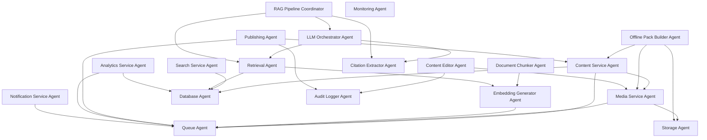

# SKA App - Agent Architecture

> Comprehensive documentation of system agents, services, and intelligent components

## Overview

This document defines the agent-based architecture of the SKA App, describing autonomous components, services, and intelligent agents that power the application. Each agent has specific responsibilities, interfaces, and behaviors that contribute to the overall system functionality.

---

## Table of Contents

1. [Backend Service Agents](#backend-service-agents)
2. [Android Application Agents](#android-application-agents)
3. [AI/RAG Agents](#airag-agents)
4. [Infrastructure Agents](#infrastructure-agents)
5. [Admin Panel Agents](#admin-panel-agents)
6. [Communication Protocols](#communication-protocols)
7. [Agent Lifecycle Management](#agent-lifecycle-management)

---

## Backend Service Agents

### 1. Content Service Agent

**Responsibility**: Manages all content entities (sermons, devotionals, quarterlies)

**Capabilities**:
- CRUD operations for content
- Content validation and sanitization
- Publishing workflow management
- Content versioning
- Cache invalidation triggers

**Interfaces**:
```typescript
interface ContentServiceAgent {
  getHome(): Promise<HomeResponse>
  getSermons(query: SermonQuery): Promise<SermonList>
  getSermon(id: number): Promise<Sermon>
  getDevotional(date: Date, timezone: string): Promise<Devotional>
  getQuarterlies(kind: QuarterlyKind, lang: string): Promise<Quarterly[]>
  publishContent(content: Content): Promise<void>
  schedulePublish(content: Content, publishAt: Date): Promise<void>
}
```

**Dependencies**:
- Database Agent
- Cache Agent
- Media Service Agent

---

### 2. Media Service Agent

**Responsibility**: Handles media asset lifecycle and delivery

**Capabilities**:
- Upload processing (validation, metadata extraction)
- Transcoding coordination with streaming providers
- CDN integration and URL generation
- Signed URL creation for private content
- Thumbnail generation
- Media optimization

**Interfaces**:
```typescript
interface MediaServiceAgent {
  uploadMedia(file: Buffer, metadata: MediaMetadata): Promise<MediaAsset>
  getMediaUrl(assetId: string, options?: UrlOptions): Promise<string>
  transcodeVideo(assetId: string): Promise<TranscodeJob>
  generateThumbnail(videoAssetId: string): Promise<MediaAsset>
  deleteMedia(assetId: string): Promise<void>
  importFromYouTube(url: string): Promise<MediaAsset>
}
```

**Dependencies**:
- Storage Agent
- Streaming Provider Agent (Mux/Cloudflare)
- Queue Agent (for async processing)

---

### 3. Search Service Agent

**Responsibility**: Full-text search across all content types

**Capabilities**:
- Multi-entity search (sermons, devotionals, lessons)
- Fuzzy matching with trigram similarity
- Search result ranking
- Search analytics
- Query suggestion

**Interfaces**:
```typescript
interface SearchServiceAgent {
  search(query: string, filters?: SearchFilters): Promise<SearchResults>
  indexContent(content: Indexable): Promise<void>
  removeFromIndex(contentId: string, type: ContentType): Promise<void>
  getSuggestions(partial: string): Promise<string[]>
  getPopularSearches(): Promise<string[]>
}
```

**Dependencies**:
- Database Agent (PostgreSQL FTS)
- Cache Agent

**Implementation Notes**:
- Uses PostgreSQL full-text search with GIN indexes
- Trigram similarity for fuzzy matching
- Upgrade path to Meilisearch/Typesense if needed

---

### 4. Notification Service Agent

**Responsibility**: Push notification management and delivery

**Capabilities**:
- Topic-based notification sending
- Notification scheduling
- Delivery tracking
- Deep link generation
- Notification personalization

**Interfaces**:
```typescript
interface NotificationServiceAgent {
  sendNotification(notification: Notification, topic: string): Promise<void>
  scheduleNotification(notification: Notification, sendAt: Date): Promise<void>
  subscribeToTopic(deviceToken: string, topic: string): Promise<void>
  unsubscribeFromTopic(deviceToken: string, topic: string): Promise<void>
  getNotificationStats(): Promise<NotificationStats>
}
```

**Dependencies**:
- FCM Service
- Queue Agent
- Analytics Agent

---

### 5. Offline Pack Builder Agent

**Responsibility**: Creates downloadable lesson packs for offline use

**Capabilities**:
- Lesson content bundling
- Asset collection (markdown, images, audio)
- ZIP archive creation
- Delta pack generation
- Pack versioning

**Interfaces**:
```typescript
interface OfflinePackBuilderAgent {
  buildLessonPack(lessonId: number): Promise<PackManifest>
  buildQuarterlyPack(quarterlyId: number): Promise<PackManifest>
  generateDeltaPack(fromVersion: string, toVersion: string): Promise<PackManifest>
  getPackMetadata(packId: string): Promise<PackMetadata>
}
```

**Dependencies**:
- Content Service Agent
- Media Service Agent
- Storage Agent

**Implementation Notes**:
- Generates optimized images for offline use
- Includes manifest for version checking
- Supports incremental updates

---

### 6. Analytics Service Agent

**Responsibility**: Event collection, processing, and reporting

**Capabilities**:
- Event ingestion
- Metrics aggregation
- User behavior tracking (anonymous)
- Performance monitoring
- Report generation

**Interfaces**:
```typescript
interface AnalyticsServiceAgent {
  trackEvent(event: AnalyticsEvent): Promise<void>
  trackBatch(events: AnalyticsEvent[]): Promise<void>
  getMetrics(query: MetricsQuery): Promise<Metrics>
  getContentPerformance(contentId: string): Promise<Performance>
  getUserEngagement(): Promise<EngagementMetrics>
}
```

**Events Tracked**:
- `video_play`, `video_complete`, `video_error`
- `audio_download`, `audio_play`
- `devotional_open`, `devotional_complete`
- `lesson_day_open`, `lesson_day_complete`
- `chat_query`, `chat_citation_click`
- `search_performed`, `search_result_click`

---

## Android Application Agents

### 7. Network Manager Agent

**Responsibility**: HTTP communication and caching strategy

**Capabilities**:
- API request execution
- Response caching (ETag/If-Modified-Since)
- Offline detection
- Request queuing
- Retry logic with exponential backoff

**Implementation**:
```kotlin
interface NetworkManagerAgent {
    suspend fun <T> executeRequest(
        request: ApiRequest,
        cacheStrategy: CacheStrategy = CacheStrategy.CACHE_FIRST
    ): Result<T>

    fun isOnline(): Boolean
    fun observeConnectivity(): Flow<ConnectivityState>
    suspend fun clearCache()
}
```

**Dependencies**:
- Retrofit/OkHttp
- Connectivity Manager
- Cache Agent

---

### 8. Cache Manager Agent

**Responsibility**: Local data persistence and cache coherence

**Capabilities**:
- Cache read/write operations
- Cache invalidation
- Stale-while-revalidate strategy
- Cache size management
- Offline data access

**Implementation**:
```kotlin
interface CacheManagerAgent {
    suspend fun <T> get(key: String, type: KClass<T>): T?
    suspend fun <T> set(key: String, value: T, ttl: Duration)
    suspend fun invalidate(key: String)
    suspend fun invalidatePattern(pattern: String)
    fun getCacheSize(): Long
    suspend fun clearExpired()
}
```

**Storage**:
- Room database for structured content
- DataStore for preferences
- File system for media

---

### 9. Download Manager Agent

**Responsibility**: Offline content downloads and management

**Capabilities**:
- Download scheduling
- Progress tracking
- Download queue management
- Resume capability
- Storage management

**Implementation**:
```kotlin
interface DownloadManagerAgent {
    suspend fun downloadLesson(lessonId: Long): DownloadJob
    suspend fun downloadAudio(sermonId: Long): DownloadJob
    suspend fun downloadDevotionals(dateRange: DateRange): List<DownloadJob>
    fun observeDownloads(): Flow<List<Download>>
    suspend fun pauseDownload(jobId: String)
    suspend fun cancelDownload(jobId: String)
    suspend fun getStorageUsage(): StorageInfo
    suspend fun clearDownloads()
}
```

**Dependencies**:
- WorkManager
- Storage Manager
- Network Manager Agent

---

### 10. Media Player Agent

**Responsibility**: Audio/video playback management

**Capabilities**:
- HLS/DASH streaming
- Background audio playback
- Picture-in-Picture mode
- Playback controls
- Media session management
- Quality adaptation

**Implementation**:
```kotlin
interface MediaPlayerAgent {
    fun play(mediaUrl: String, metadata: MediaMetadata)
    fun pause()
    fun seekTo(position: Long)
    fun setPlaybackSpeed(speed: Float)
    fun observePlaybackState(): Flow<PlaybackState>
    fun observePosition(): Flow<Long>
    fun enablePiP()
    fun setQuality(quality: Quality)
}
```

**Dependencies**:
- Media3/ExoPlayer
- MediaSession
- Notification Manager

---

### 11. Sync Agent

**Responsibility**: Background content synchronization

**Capabilities**:
- Periodic content refresh
- Intelligent prefetching
- Delta synchronization
- Conflict resolution
- Battery-aware scheduling

**Implementation**:
```kotlin
interface SyncAgent {
    suspend fun syncAll()
    suspend fun syncContent(type: ContentType)
    suspend fun prefetchRecommended()
    fun scheduleSyncWork(interval: Duration)
    fun observeSyncStatus(): Flow<SyncStatus>
}
```

**Dependencies**:
- WorkManager
- Network Manager Agent
- Cache Manager Agent

**Sync Strategy**:
- Daily devotionals: Prefetch next 7 days
- Sermons: Sync metadata, lazy-load media
- Quarterlies: Sync current quarter + next

---

### 12. Feature Flag Agent

**Responsibility**: Remote feature configuration

**Capabilities**:
- Feature flag evaluation
- Remote config fetching
- A/B test variant assignment
- Flag caching

**Implementation**:
```kotlin
interface FeatureFlagAgent {
    fun isEnabled(flag: FeatureFlag): Boolean
    fun getVariant(experiment: String): String
    suspend fun refresh()
    fun observeFlag(flag: FeatureFlag): Flow<Boolean>
}

enum class FeatureFlag {
    ENABLE_CHAT,
    ENABLE_DOWNLOADS,
    ENABLE_KIDS,
    ENABLE_YOUTUBE_IMPORT
}
```

**Dependencies**:
- Firebase Remote Config or custom solution
- Cache Agent

---

## AI/RAG Agents

### 13. Embedding Generator Agent

**Responsibility**: Generate vector embeddings for content

**Capabilities**:
- Text preprocessing
- Embedding generation
- Batch processing
- Caching of embeddings
- Model version management

**Interfaces**:
```typescript
interface EmbeddingGeneratorAgent {
  generateEmbedding(text: string): Promise<number[]>
  generateBatch(texts: string[]): Promise<number[][]>
  getModelInfo(): ModelInfo
}
```

**Implementation Notes**:
- Uses OpenAI text-embedding-3-large or equivalent
- Implements retry logic and rate limiting
- Caches embeddings to reduce API calls

---

### 14. Document Chunker Agent

**Responsibility**: Intelligent text chunking for RAG

**Capabilities**:
- Semantic chunking
- Overlap management
- Metadata preservation
- Chunk size optimization
- Scripture reference detection

**Interfaces**:
```typescript
interface DocumentChunkerAgent {
  chunkDocument(document: SourceDocument): Promise<Chunk[]>
  optimizeChunkSize(content: string, maxTokens: number): number
  extractMetadata(chunk: string): ChunkMetadata
}
```

**Chunking Strategy**:
- 500-1,000 tokens per chunk
- 100-token overlap
- Preserve paragraph boundaries
- Keep verse references intact

---

### 15. Retrieval Agent

**Responsibility**: Hybrid search for relevant context retrieval

**Capabilities**:
- Vector similarity search
- BM25 full-text search
- Hybrid ranking
- Context scoping
- Reranking

**Interfaces**:
```typescript
interface RetrievalAgent {
  retrieve(
    query: string,
    mode: 'quarterly' | 'bible',
    contextRef?: string,
    topK: number = 12
  ): Promise<RetrievalResult[]>

  rerank(query: string, results: RetrievalResult[]): RetrievalResult[]
}
```

**Retrieval Pipeline**:
1. Generate query embedding
2. Vector search (cosine similarity)
3. BM25 keyword search
4. Merge and rerank results
5. Apply context scoping
6. Return top-K with metadata

---

### 16. LLM Orchestrator Agent

**Responsibility**: LLM interaction and response generation

**Capabilities**:
- Prompt construction
- Streaming response handling
- Citation extraction
- Safety filtering
- Error handling and fallbacks

**Interfaces**:
```typescript
interface LLMOrchestratorAgent {
  generateAnswer(
    query: string,
    contexts: RetrievalResult[],
    mode: ChatMode
  ): Promise<ChatResponse>

  streamAnswer(
    query: string,
    contexts: RetrievalResult[]
  ): AsyncIterable<ChatChunk>

  validateResponse(response: string): ValidationResult
}
```

**System Prompts**:

**Quarterly Mode**:
```
You are an assistant helping with Sabbath School lesson study. Answer only from
the provided lesson materials and Bible references. Include citations for all claims.
If the answer isn't in the materials, say "This isn't covered in today's lesson."
```

**Bible Q&A Mode**:
```
You are a Bible study assistant. Answer only from the provided Bible text and study
notes. Include verse citations. If the answer requires interpretation beyond the
provided texts, acknowledge the limitation.
```

---

### 17. Citation Extractor Agent

**Responsibility**: Extract and format citations from LLM responses

**Capabilities**:
- Citation parsing
- Reference validation
- Link generation
- Snippet extraction
- Deduplication

**Interfaces**:
```typescript
interface CitationExtractorAgent {
  extractCitations(response: string, contexts: RetrievalResult[]): Citation[]
  formatCitations(citations: Citation[], format: CitationFormat): string
  validateCitation(citation: Citation): boolean
}
```

**Citation Format**:
```typescript
interface Citation {
  sourceRef: string  // e.g., "lesson_day:123" or "bible:John.3.16"
  snippet: string
  title: string
  url?: string
}
```

---

### 18. RAG Pipeline Coordinator

**Responsibility**: Orchestrate the entire RAG pipeline

**Capabilities**:
- Pipeline execution
- Error recovery
- Performance monitoring
- Cache management
- Query analysis

**Interfaces**:
```typescript
interface RAGPipelineCoordinator {
  async handleQuery(request: ChatRequest): Promise<ChatResponse> {
    // 1. Validate and analyze query
    const analysis = await this.analyzeQuery(request.query)

    // 2. Retrieve relevant contexts
    const contexts = await this.retrievalAgent.retrieve(
      request.query,
      request.mode,
      request.contextRef,
      request.topK
    )

    // 3. Generate answer with LLM
    const response = await this.llmAgent.generateAnswer(
      request.query,
      contexts,
      request.mode
    )

    // 4. Extract and format citations
    const citations = await this.citationAgent.extractCitations(
      response.answer,
      contexts
    )

    // 5. Validate and return
    return {
      answer: response.answer,
      citations,
      safety: response.safety
    }
  }
}
```

---

## Infrastructure Agents

### 19. Database Agent

**Responsibility**: Database connection pooling and query execution

**Capabilities**:
- Connection management
- Transaction handling
- Query optimization
- Migration execution
- Health monitoring

**Interfaces**:
```typescript
interface DatabaseAgent {
  query<T>(sql: string, params: any[]): Promise<T[]>
  transaction<T>(fn: (tx: Transaction) => Promise<T>): Promise<T>
  healthCheck(): Promise<HealthStatus>
}
```

---

### 20. Storage Agent

**Responsibility**: Object storage operations

**Capabilities**:
- File upload/download
- Presigned URL generation
- Bucket management
- CDN integration
- Access control

**Interfaces**:
```typescript
interface StorageAgent {
  upload(bucket: string, key: string, data: Buffer): Promise<string>
  download(bucket: string, key: string): Promise<Buffer>
  getSignedUrl(bucket: string, key: string, ttl: number): Promise<string>
  delete(bucket: string, key: string): Promise<void>
}
```

---

### 21. Queue Agent

**Responsibility**: Asynchronous job processing

**Capabilities**:
- Job enqueueing
- Worker management
- Retry logic
- Dead letter queue
- Job monitoring

**Interfaces**:
```typescript
interface QueueAgent {
  enqueue(job: Job): Promise<string>
  process(jobType: string, handler: JobHandler): void
  getJobStatus(jobId: string): Promise<JobStatus>
  cancelJob(jobId: string): Promise<void>
}
```

**Job Types**:
- Video transcoding
- Embedding generation
- Offline pack building
- Notification sending
- Content indexing

---

### 22. Monitoring Agent

**Responsibility**: System observability and alerting

**Capabilities**:
- Metric collection
- Log aggregation
- Error tracking
- Performance monitoring
- Alert management

**Interfaces**:
```typescript
interface MonitoringAgent {
  recordMetric(name: string, value: number, tags?: Record<string, string>): void
  logError(error: Error, context?: Record<string, any>): void
  startTrace(name: string): Trace
  setAlert(condition: AlertCondition, handler: AlertHandler): void
}
```

---

## Admin Panel Agents

### 23. Content Editor Agent

**Responsibility**: Rich content editing experience

**Capabilities**:
- Markdown editing with preview
- Drag-and-drop media insertion
- Auto-save
- Version history
- Collaboration (future)

**Implementation**:
```typescript
interface ContentEditorAgent {
  renderPreview(markdown: string): Promise<string>
  uploadPastedImage(imageData: Blob): Promise<string>
  autoSave(content: Content): Promise<void>
  getVersionHistory(contentId: string): Promise<Version[]>
}
```

---

### 24. Publishing Agent

**Responsibility**: Content publishing workflow

**Capabilities**:
- Publish scheduling
- Workflow state management
- Approval routing (future)
- Rollback capability
- Publishing analytics

**Implementation**:
```typescript
interface PublishingAgent {
  schedulePublish(contentId: string, publishAt: Date): Promise<void>
  publishNow(contentId: string): Promise<void>
  unpublish(contentId: string): Promise<void>
  rollback(contentId: string, version: string): Promise<void>
}
```

---

### 25. Audit Logger Agent

**Responsibility**: Comprehensive audit trail

**Capabilities**:
- Action logging
- User tracking
- Change detection
- Log querying
- Compliance reporting

**Implementation**:
```typescript
interface AuditLoggerAgent {
  logAction(action: AuditAction): Promise<void>
  getAuditLog(filters: AuditFilters): Promise<AuditEntry[]>
  generateReport(period: DateRange): Promise<AuditReport>
}

interface AuditAction {
  userId: string
  action: string  // e.g., "sermon.create", "devotional.update"
  entityType: string
  entityId: string
  changes?: Record<string, { old: any, new: any }>
  metadata?: Record<string, any>
}
```

---

## Communication Protocols

### Event-Driven Communication

**Event Bus**: Agents communicate via event publishing/subscription

```typescript
interface EventBus {
  publish(event: DomainEvent): Promise<void>
  subscribe(eventType: string, handler: EventHandler): void
}

// Example events
interface SermonPublishedEvent extends DomainEvent {
  type: 'sermon.published'
  sermonId: number
  publishedAt: Date
}

interface LessonUpdatedEvent extends DomainEvent {
  type: 'lesson.updated'
  lessonId: number
  changes: string[]
}
```

### Request-Response Pattern

**API Contracts**: Typed request/response for synchronous operations

```typescript
interface Request<T> {
  id: string
  timestamp: Date
  payload: T
}

interface Response<T> {
  requestId: string
  success: boolean
  data?: T
  error?: Error
}
```

---

## Agent Lifecycle Management

### Initialization

```typescript
class AgentManager {
  private agents: Map<string, Agent> = new Map()

  async initialize() {
    // 1. Infrastructure agents first
    await this.startAgent('database', new DatabaseAgent())
    await this.startAgent('storage', new StorageAgent())
    await this.startAgent('queue', new QueueAgent())

    // 2. Service agents
    await this.startAgent('media', new MediaServiceAgent())
    await this.startAgent('content', new ContentServiceAgent())
    await this.startAgent('search', new SearchServiceAgent())

    // 3. AI agents
    await this.startAgent('embedding', new EmbeddingGeneratorAgent())
    await this.startAgent('retrieval', new RetrievalAgent())
    await this.startAgent('llm', new LLMOrchestratorAgent())

    // 4. Orchestrators
    await this.startAgent('rag', new RAGPipelineCoordinator())
  }

  async shutdown() {
    // Graceful shutdown in reverse order
    for (const [name, agent] of Array.from(this.agents).reverse()) {
      await agent.stop()
    }
  }
}
```

### Health Monitoring

```typescript
interface AgentHealth {
  name: string
  status: 'healthy' | 'degraded' | 'unhealthy'
  lastCheck: Date
  metrics: {
    uptime: number
    requestCount: number
    errorRate: number
    avgResponseTime: number
  }
}

interface AgentMonitor {
  getHealth(agentName: string): Promise<AgentHealth>
  getAllHealth(): Promise<AgentHealth[]>
  watchAgent(agentName: string, callback: (health: AgentHealth) => void): void
}
```

---

## Agent Dependencies Graph



---

## Best Practices

### 1. Single Responsibility
Each agent has a clear, focused responsibility. Avoid creating "god agents" that do too much.

### 2. Interface Segregation
Agents expose only the interfaces they need. Use TypeScript interfaces or Kotlin interfaces for contracts.

### 3. Dependency Injection
Use DI containers (Hilt for Android, TypeScript DI framework for backend) to manage agent lifecycles.

### 4. Error Handling
All agents implement consistent error handling:
- Retry logic for transient failures
- Circuit breakers for external services
- Graceful degradation
- Comprehensive logging

### 5. Testing
- Unit test each agent in isolation
- Use mocks for dependencies
- Integration tests for agent interactions
- Contract tests for interfaces

### 6. Observability
All agents emit:
- Metrics (operation count, latency, errors)
- Logs (structured, with context)
- Traces (distributed tracing)

---

## Conclusion

This agent architecture provides a modular, scalable foundation for the SKA App. Each agent is designed for:
- **Autonomy**: Self-contained with clear boundaries
- **Composability**: Can be combined to create complex workflows
- **Testability**: Easy to test in isolation
- **Maintainability**: Clear responsibilities and interfaces
- **Scalability**: Can be deployed and scaled independently

As the application evolves, new agents can be added and existing ones refined while maintaining system integrity.

---

**Document Version**: 1.0
**Last Updated**: 2025-11-18
**Status**: Ready for implementation
